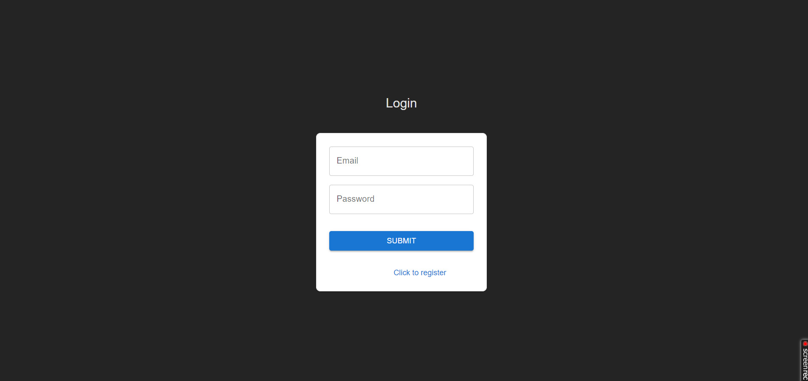
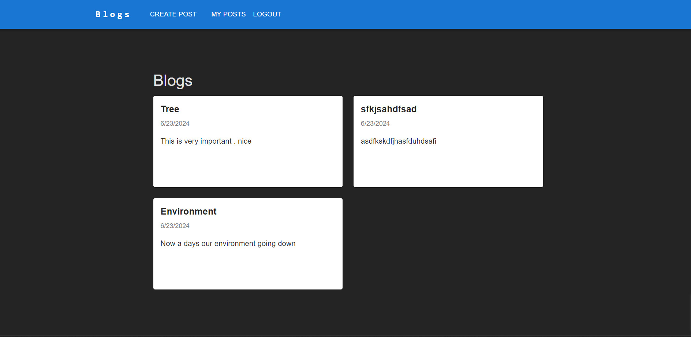
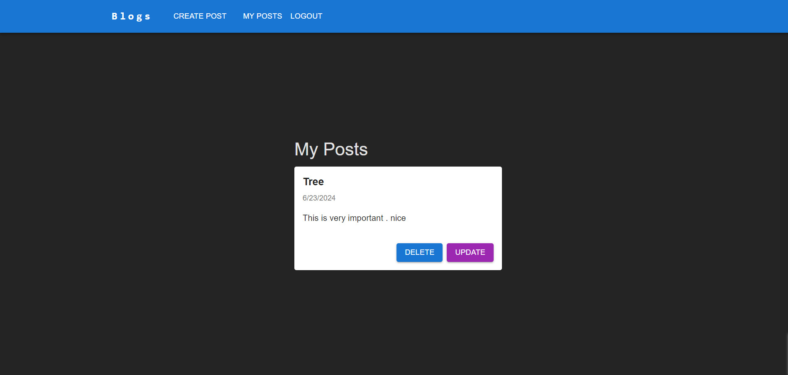
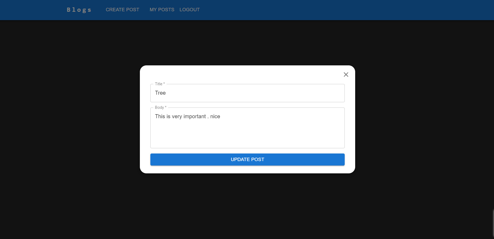
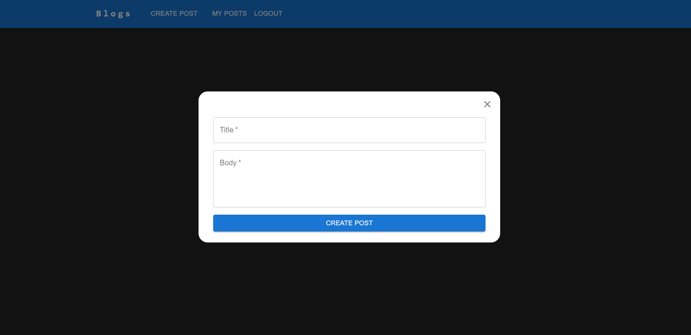

# Blog 

### Description

- Sign Up for a user
- Sign In for a user
- CRUD operations on an Blogs


## API Reference

#### URL = [https://asset-management-0au6.onrender.com](https://blog-w1fr.onrender.com)
local url=http://localhost:8080/ ( for Server)
 
#### Create User

```http
  POST /api/v1/users/create
```

| Body (application/json) | Type     | Description   |
| :---------------------- | :------- | :------------ |
| `name`                  | `string` | **Required**. |
| `email`                 | `string` | **Required**. |
| `password`              | `string` | **Required**. |

#### Login

```http
  POST /api/v1/auth/login
```

| Parameter  | Type     | Description   |
| :--------- | :------- | :------------ |
| `email`    | `string` | **Required**. |
| `password` | `string` | **Required**. |

#### create an blog

```http
  POST /api/v1/blog/create
```

| Body (multipart/form-data) | params   | Type       | Description   |
| :------------------------- | :------- | :--------- | :------------ |

| `title`                     | `-`      | `string`   | **Required**. |
| `body`                      | `-`      | `string`   | **Required**. |
| `author`                     | `-`      | `string`   | **Required**. |


#### Get an blogs by blog Id

```http
  GET /api/v1/blog/user/:userId
```

| Parameter | Type       | Description   |
| :-------- | :--------- | :------------ |
| `blogId` | `ObjectId` | **Required**. |

#### Get all  blog

```http
  GET /api/v1/blog/getAll
```

| Parameter | Type       | Description   |
| :-------- | :--------- | :------------ |
| `-`  | `-` | **Required**. |

#### Update an blog by blog Id

```http
  PUT /api/v1/blog/update/:blogId
```

| Body (application/json) | params    | Type       | Description   |
| :---------------------- | :-------- | :--------- | :------------ |
| `-`                     | `blogId` | `ObjectId` | **Required**. |
| `title`                  | `-`       | `string`   | **Required**. |
| `body`              | `-`       | `string`   | **Required**. |

#### Delete an blog by blog Id

```http
  DELETE /api/v1/blog/delete/:blogId
```

| Parameter | Type       | Description   |
| :-------- | :--------- | :------------ |
| `blogId` | `ObjectId` | **Required**. |

## UI Demo

[https://asset-management-0au6.onrender.com](https://blog-w1fr.onrender.com)/dashboard

## Environment Variables

To run this project locally, you will need to add the following environment variables to your .env file created in root directory of your project

- JWT_SECRET
- MONGO_DEV_URL


#### Note: Also, you will need to update proxy in vite.config() by localhost:${port_number}

## Screenshots

### Login



### Blogs



### My post 


### Update


### Create Post



## cURL - Refer Api Reference as well

### create a user

```bash
  curl --location 'https://asset-management-0au6.onrender.com/api/v1/user/create' \
--header 'Content-Type: application/x-www-form-urlencoded' \
--data-urlencode 'name=****' \
--data-urlencode 'email=******' \
--data-urlencode 'password=*****'
```

### login a user

```bash
  curl --location 'https://asset-management-0au6.onrender.com/api/v1/auth/login' \
--header 'Content-Type: application/x-www-form-urlencoded' \
--data-urlencode 'email=**********' \
--data-urlencode 'password=*******'
```


